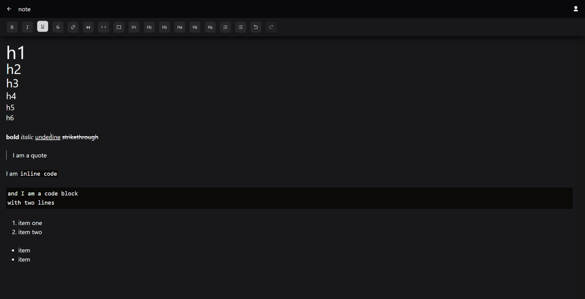

# deep-note

> Rich text note-taking app featuring infinite-depth folders for organization.

**Features**:

-   Mobile-first responsive design, Auth
-   React (Vite), Typescript, Tailwind CSS, TanStack / React Query, MongoDB, Jest

### Folder

### Rich text editor with [Tiptap](https://tiptap.dev/docs/editor/introduction)

### Authentication with [Auth0](https://auth0.com/)

## Development

`npm run dev` to concurrently run frontend Vite server and backend server.

### ENV

-   you'll need to configure Auth0 in both the [/frontend](./frontend/) and [/backend](./backend) projects.
-   `MONGODB_CONNECTION_STRING`, `MONGODB_DB_NAME`

### Migrations

Navigate to [/backend](./backend) project:

-   `npm run migrate-up`
-   `npm run migrate-down`
-   `npx migrate-mongo create [filename]`

## Production (Heroku)

Check the `Procfile` to see the commands available to `heroku run ...`.
